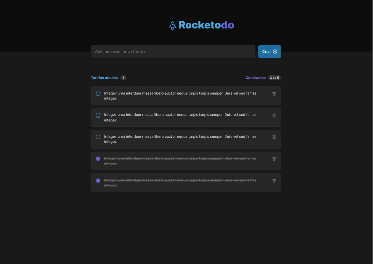

# Rocketodo

<p align="center">
  
  <!--  -->
</p>

<p align="center">
  
  
  


</p>

<h1 align="center">
<!--      -->
</h1>

<br>

## ✍ Short Description

Web Aplication developed in ignite Course. This is todo list made with react and using some functions

## 🧪 Technologies

This project was developed using the following technologies:

- REACT
- COMPONENTS
- USESTATE

## 🚀 Getting started

Clone the project and access the folder.

```bash
git clone https://github.com/REPOSITORY
cd react-todo
```

Run this command to install the dependencies.

```bash
npm i
npm run dev
```

## 🔖 Layout

You can view the project through the links below:

- [Live Preview](https://reactodo.thiagolemos.tech/)

- [Figma](<https://www.figma.com/file/X7DhRHqg40bbXvuwbA31oi/ToDo-List-(Copy)?node-id=43%3A88>)

- Remembering that you need to have a [Figma](http://figma.com/) account to access it.

## 🚧 Projeto:

In development 🚧

<!-- ## 🎨 Inspiração:
Figma: https://www.figma.com/file/2A51gQJCk5V6LxcIh2en0b/HBO-Max-Redesign-Web-App-(Community) -->

## 📝 License

This project is licensed under the MIT License. See the [LICENSE](LICENSE) file for details.

---

Made with 💙 by [Thiago Lemos](https://www.thiagolemos.tech) 👋
